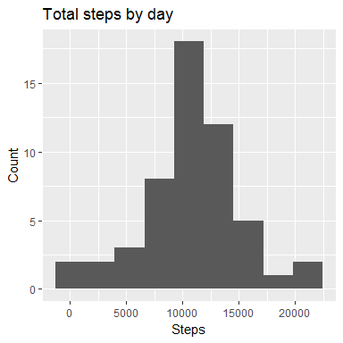
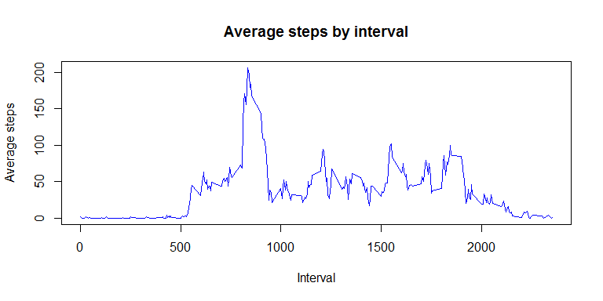
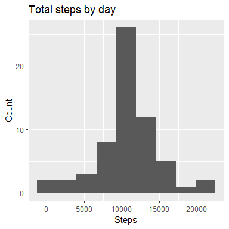
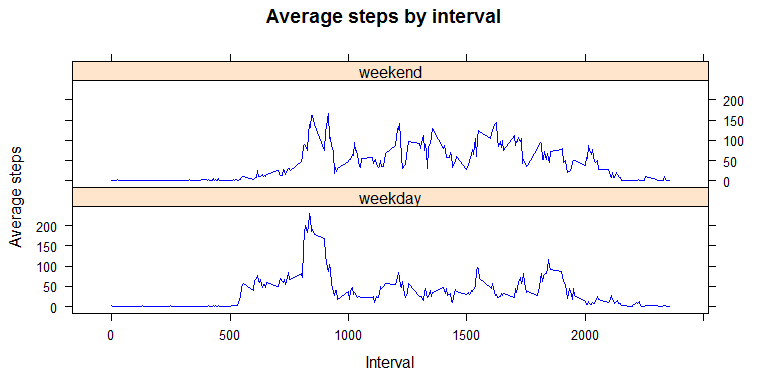

## Loading and preprocessing the data
Firstly the data was unzipped and the CSV file read. There is not much cleaning to do to the data at this point, except for the NA handling which is addressed a later stage in this project.


```r
file1<-unzip('activity.zip')
data<-read.csv(file1)
```


## What is mean total number of steps taken per day?
An exploratory histogram was made to see the total number of steps taken per day by the test subject, throughout the duration of the test (61 days).


```r
library(ggplot2)
sumbyday<-aggregate(steps~date,data,sum)
qplot(steps, data=sumbyday,bins=9,xlab='Steps',main='Total steps by day',
      ylab='Count')
```

<!-- -->

The average number of steps taken by day was:


```r
mean(sumbyday$steps)
```

```
## [1] 10766.19
```

And the median number of steps throughout the duration of the project was:


```r
median(sumbyday$steps)
```

```
## [1] 10765
```

## What is the average daily activity pattern?
The average number of steps in a daily manner was taken by the mean of the steps taken over a given interval, the plot is shown next.


```r
meanbyint<-aggregate(steps~interval,data,mean)
plot(meanbyint$interval,meanbyint$steps,type='l',xlab='Interval',
     main='Average steps by interval',ylab='Average steps',col='blue')
```

<!-- -->

The interval with the maximum number of steps taken in average is:


```r
meanbyint[which.max(meanbyint[,2]),1]
```

```
## [1] 835
```

Meaning that the subject, on average, was mor active at 8:35am.
 
## Imputing missing values

As stated before, the most important cleaning process to be done in the data is dealing with the NA values. The numeber of intervals that don't contain a number of steps is


```r
sum(is.na(data))
```

```
## [1] 2304
```

The data is the copied into a new dataframe which will be modified. New values wer input into the NAs entries, assigning to each NA the average number of steps given in that time interval throughout the duration of the test. The code used is the following:


```r
data2<-data
indexes<-which(is.na(data$steps))
int<-data$interval[is.na(data$steps)]
for (i in (1:length(indexes))){
        data2$steps[indexes[i]]<-meanbyint$steps[meanbyint$interval==int[i]]
}
```

Then the values and plot done in the second section of this project were recalculated and show the following results.


```r
sumbyday2<-aggregate(steps~date,data2,sum)
qplot(steps, data=sumbyday2,bins=9,xlab='Steps',main='Total steps by day',
      ylab='Count')
```

<!-- -->

```r
mean(sumbyday2$steps)
```

```
## [1] 10766.19
```

```r
median(sumbyday2$steps)
```

```
## [1] 10766.19
```
So, after inputing values to the NA entries, the mean was not affected, whilst the median was affected. Another change in the data set is that the number of steps is now not an integer variable, but a floating point one.

## Are there differences in activity patterns between weekdays and weekends?

A new variable was created to determine if the date for each entry was made on weekdays or on weekend ones.

```r
data2$date<-as.Date(data2$date,format='%Y-%m-%d')
data2$weekday<-weekdays(data2$date)
we<-c('sábado','domingo')
wd<-c('lunes','martes','miércoles','jueves','viernes')
for (i in 1:5){
        data2$weekday<-gsub(wd[i], "weekday", data2$weekday)
}
for (i in 1:2){
        data2$weekday<-gsub(we[i], "weekend", data2$weekday)
}
data2$weekday<-as.factor(data2$weekday)
```
**Note.**The weekdays are in Spanish since R threw the results in that language.

And finally a panel plot was created as a comparison of activity patterns between weekends and weekdays.


```r
meanbyint2<-aggregate(steps~interval+weekday,data2,mean)
library(lattice)
xyplot(steps~interval|weekday,data=meanbyint2,layout=c(1,2),
       type='l',xlab='Interval',main='Average steps by interval',
       ylab='Average steps',col='blue')
```

<!-- -->

It can be seen that weekend days have a more uniform pattern, i.e. the number of steps is spread out more 'evenly' through the intervals that on weekdays.
